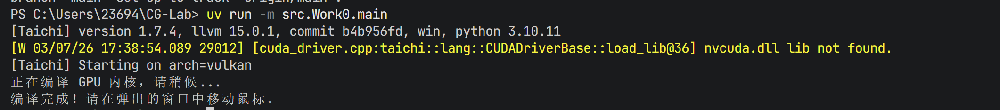
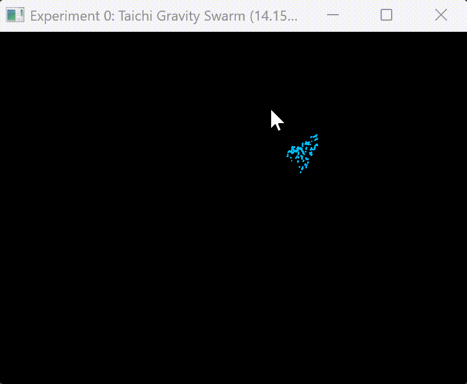

# CG-Lab 课程作业

## 实验一：引力粒子群模拟
这个项目用 Taichi 语言实现了一个简单的粒子系统，模拟了成千上万个粒子在鼠标引力下的运动效果。

### 项目结构
代码主要放在 `src/Work0/` 文件夹里：

-   `main.py`: 程序的主入口，负责创建窗口和处理用户输入。
-   `physics.py`: 核心的物理模拟部分，用 Taichi 的 kernel 函数实现。
-   `config.py`: 存放一些可以调整的参数，比如粒子数量、引力大小等。

### 功能实现

-   **粒子模拟**: 所有粒子都会被鼠标吸引，飞向鼠标指针。
-   **GPU 加速**: 使用 Taichi 将计算任务并行化，放在 GPU 上运行，所以即使有很多粒子也能非常流畅。
-   **边界碰撞**: 粒子碰到窗口边缘会反弹回来。

### 代码逻辑

主要的逻辑在 `physics.py` 的 `update_particles` 函数里。每一帧，这个函数都会在 GPU 上为每一个粒子做以下几件事：

1.  计算从粒子到鼠标位置的方向。
2.  给粒子一个朝向鼠标的加速度。
3.  加上一点空气阻力，让运动更真实。
4.  更新粒子的位置。
5.  检查是否碰到边界，如果碰到了就让它反弹。

### 运行效果

---

## 实验二：海战游戏 (Battleship)

这是一个经典的 10x10 海战棋游戏，实现了玩家与电脑对战的功能。

### 项目结构
代码和报告直接放在根目录下：

-   [battleship_game.py](battleship_game.py): 游戏的主程序，包含了棋盘逻辑、电脑 AI 和游戏循环。
-   [REPORT.md](REPORT.md): 详细的算法实现报告，解释了“蛮力模式匹配”的思路。

### 实现功能
-   **10x10 棋盘**: 标准的海战棋盘规模。
-   **5 种战舰**: 包含驱逐舰、潜艇、巡洋舰、战列舰和航空母舰。
-   **智能 AI**: 电脑采用蛮力搜索与模式匹配相结合的算法，能够追踪并击沉玩家的船只。
-   **严格规则**: 实现了船只互不接触（包括对角线）的放置规则。

### 运行效果
(TODO: 在这里放一张海战游戏运行时的截图)
