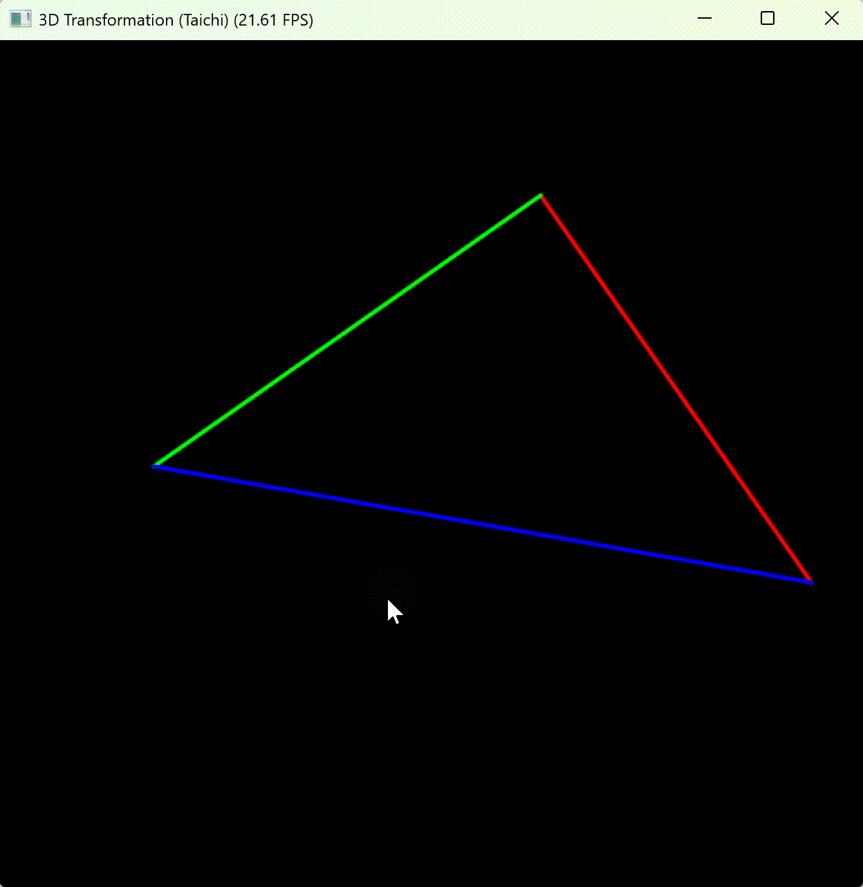

# CG-Lab 课程作业

## 实验二：旋转与变换
这个项目使用 **Taichi** 实现了基础的 MVP 变换。

## 实现功能
1. **MVP 变换**：实现了模型（Model）、视图（View）及透视投影（Projection）矩阵。
2. **实时交互**：可以通过键盘 `A`、`D` 键实时控制物体绕 Z 轴旋转。
3. **坐标映射**：将 3D 空间顶点经过变换、透视除法后，映射到 2D 屏幕坐标进行显示。

## 项目架构
核心代码都在 `main.py` 中：
- **数学变换**：包含了 `get_model_matrix`、`get_view_matrix` 和 `get_projection_matrix` 函数，负责生成变换矩阵。
- **并行计算**：通过 Taichi 的 `compute_transform`在并行架构上完成顶点的矩阵乘法和透视除法。
- **渲染展示**：利用 `ti.GUI` 循环监听键盘事件，并实时绘制变换后的三角形边框。

---

## 代码逻辑
1. **矩阵推导**：
   - **Model**: 绕 Z 轴旋转矩阵。
   - **View**: 将相机平移至原点的变换。
   - **Projection**: 先将视锥体压缩为长方体，再通过正交投影缩放到 NDC 空间。
2. **处理流程**：
   - 每一帧先根据当前旋转角度更新 MVP 复合矩阵。
   - 对每个顶点进行 `MVP * v4` 变换。
   - 执行**透视除法**得到 NDC 坐标。
   - 最后进行**视口变换**，将 NDC 坐标映射到 GUI 窗口的 `[0, 1]` 范围。

### 运行效果

