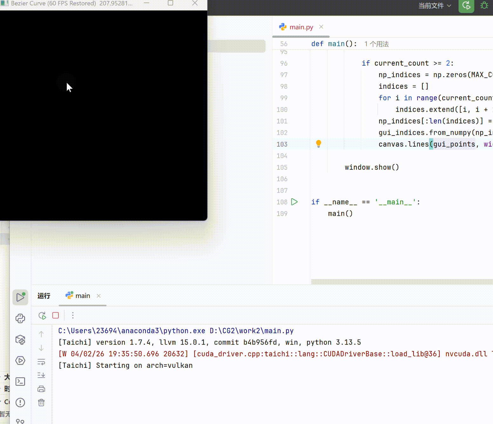

# CG-Lab 课程作业

## 实验三：Bezier 曲线绘制
这个项目使用 **Taichi** 实现了一个交互式的 Bezier 曲线绘制工具，完成了高效的曲线生成与渲染。

## 实现功能
1. **交互式绘图**：通过鼠标左键在窗口中点击，即可实时添加控制点并生成曲线。
2. **Bezier 算法**：在 Taichi kernel 中实现了迭代式的 **De Casteljau 算法**，支持多阶曲线的实时计算。
3. **像素级并行渲染**：利用 GPU 并行处理能力，同时计算曲线上的 1000 个采样点，并直接在像素缓冲区中点亮对应位置。
4. **画布重置**：按下键盘 `C` 键可清空所有控制点和画布。

## 项目架构
核心代码位于 `main.py` 中：
- **数据结构**：使用 `ti.Vector.field` 存储控制点坐标和屏幕像素颜色。
- **并行计算内核**：
    - `clear_pixels`：并行清空背景像素，确保每一帧都是干净的画布。
    - `draw_bezier_kernel`：核心函数。对于每一个曲线采样点，在 GPU 线程中执行 De Casteljau 迭代，计算最终坐标并涂色。
- **绘制展示**：利用 `ti.ui.Window` 监听用户输入，管理控制点列表，并驱动渲染循环。

---

## 代码逻辑
1. ***De Casteljau 递归求值***
   - 使用纯 Python 递归的方式实现了标准的 De Casteljau 算法。
   - 在主循环中，当屏幕上的控制点数量达到 2 个及以上时，系统会将贝塞尔曲线均匀采样为 1000 份。
   - 通过遍历采样参数 t，在 CPU 端计算出曲线上所有离散点的二维坐标，并将这些坐标暂存到一个 NumPy 数组中。

2. ***性能优化，与 GPU 并行渲染***          
   - 将 CPU 算好的 1001 个点位数据一次性拷贝至显存中的 Taichi 缓冲区（curve_points_field），将原本的 1000 次内存通信降为 1 次。
   - 调用 @ti.kernel 装饰的 draw_curve_kernel 函数。该函数在 GPU 的多个核心上并发执行，将浮点坐标快速映射为屏幕空间的整型像素索引，并对 pixels 对应的像素完成着色。                                                            

3. ***人机交互与控制多边形绘制***                                   
   - 通过 Taichi 提供的 GUI 接口维护渲染的主循环。
   - 实时监听鼠标左键事件来动态添加控制点，或通过监听键盘的 'c' 键来清空画布。
   在每一帧的最后阶段，程序会将控制点的坐标同步给 GUI 缓冲区，利用 Canvas API 绘制出红色的控制点以及灰色的特征多边形连线，从而直观地展示曲线与控制点之间的几何关系。

### 运行效果

