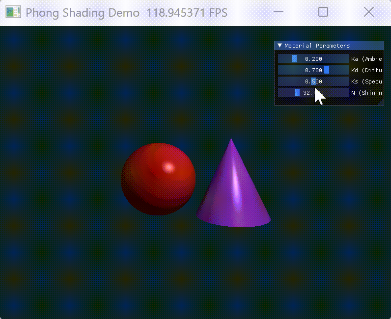

# CG-Lab 课程作业

## 实验四：Phong 光照模型
这个项目使用 **Taichi** 实现了基础的光线投射算法，并结合 **Phong 光照模型** 展示了球体与圆锥体的 3D 渲染效果。

## 实现功能
1. **光线投射 (Ray Casting)**：实现了光线与球体、圆锥体的数学相交测试。
2. **Phong 光照模型**：包含了环境光（Ambient）、漫反射（Diffuse）和高光（Specular）三部分的完整计算。
3. **实时交互调节**：通过 GUI 窗口提供滑动条，可实时调节材质参数（Ka, Kd, Ks, Shininess）。
4. **GPU 并行渲染**：利用 Taichi 的并行内核，对 800x600 的像素点进行实时的 GPU 渲染。

## 项目架构
核心代码位于 `main.py` 中：
- **几何相交测试**：`intersect_sphere` 和 `intersect_cone` 函数，负责光线与物体的数学求交逻辑。
- **并行渲染内核**：`render` 内核函数，执行逐像素的光线生成、求交测试、光照计算及着色。
- **GUI 交互面板**：利用 `ti.ui` 构建交互面板，实现材质参数的实时动态同步。

---

## 代码逻辑
1. **数学求交**：
   - **球体**：通过射线与球面的二元一次方程组求解。
   - **圆锥**：将光线转换至圆锥局部坐标系，通过一元二次方程判断交点是否在高度范围内。
2. **光照计算 (Phong Model)**：
   - **Ambient**:
     $$I_{ambient} = K_a \times C_{light} \times C_{object}$$
   - **Diffuse**:
     $$I_{diffuse} = K_d \times \max(0, \mathbf{N} \cdot \mathbf{L}) \times C_{light} \times C_{object}$$
   - **Specular**:
     $$I_{specular} = K_s \times \max(0, \mathbf{R} \cdot \mathbf{V})^n \times C_{light}$$

   > **注**：$\mathbf{N}$ 为表面法向量，$\mathbf{L}$ 为指向光源的方向向量，$\mathbf{V}$ 为指向摄像机的方向向量，$\mathbf{R}$ 为光线的理想反射向量，$n$ 为高光指数 Shininess。
3. **效果实现**：
   - 每一帧渲染时，为每个像素分配一个线程。
   - 线程生成射线，遍历场景物体，记录最近的交点 `min_t`。
   - 若有交点，则根据该点的法线（Normal）和材质参数计算 Phong 着色。

### 运行效果
